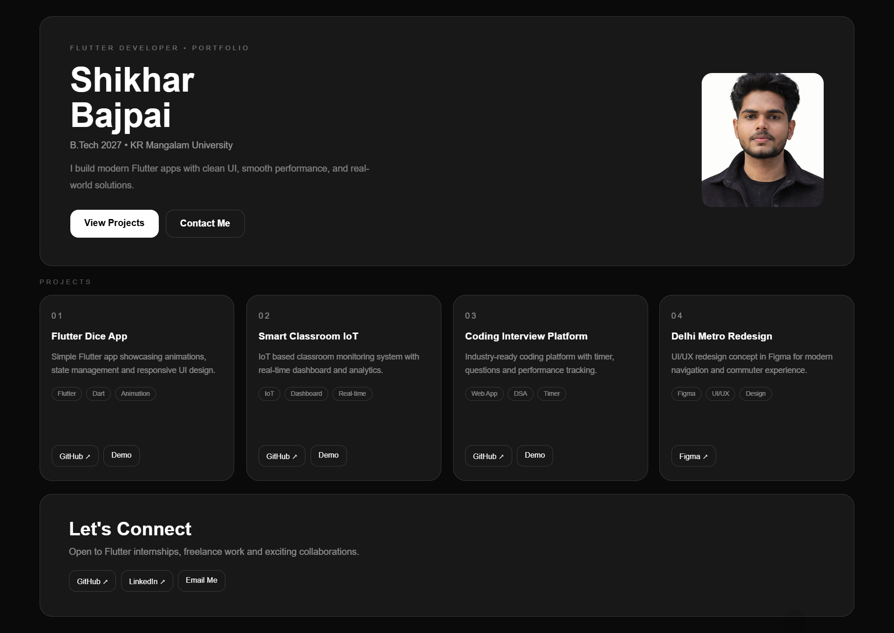

# 🚀 Shikhar Bajpai Portfolio

A modern **glassmorphism-based personal portfolio website** built to showcase my **Flutter development, UI/UX, and real-world projects**.

This portfolio highlights my work in:
- 📱 Flutter App Development
- 🎨 UI/UX Design
- 🌐 Web Projects
- 📊 IoT Dashboards
- 💻 Coding Platforms

---

## ✨ Live Portfolio
🔗 **Live Demo:** [View Portfolio](https://shikhar-bajpai-portfolio.vercel.app/)

---

## 📸 Preview

---

## 🛠️ Tech Stack
- **HTML5**
- **CSS3**
- **Responsive Design**
- **Glassmorphism UI**
- **Modern Grid Layout**
- **Vercel Deployment**

---

## 📂 Featured Projects

### 🎲 Flutter Dice App
A simple Flutter app showcasing:
- smooth animations
- state management
- responsive UI

🔗 GitHub: https://github.com/shikhar11x/Flutter-Dice  
🔗 Live Demo: https://flutter-dice-blazestack.vercel.app/

---

### 🌍 Smart Classroom IoT
IoT-based classroom monitoring system with:
- real-time dashboard
- analytics
- live sensor data
- environment insights

🔗 GitHub: https://github.com/shikhar11x/IoT-Based-Smart-Classroom-Environment-Monitoring-System-6th-SEM  
🔗 Live Demo: https://smartclassroomk.vercel.app/

---

### 💻 Coding Interview Platform
An industry-ready coding interview practice platform featuring:
- coding timer
- DSA questions
- performance tracking
- clean UI

🔗 GitHub: https://github.com/shikhar11x/VirtualCodingInterviewPlatform  
🔗 Live Demo: https://codein-blazestack.vercel.app/

---

### 🚇 Delhi Metro UI/UX Redesign
A Figma-based redesign concept focused on:
- modern navigation
- better commuter UX
- simplified flow
- clean interface

🔗 Figma: https://www.figma.com/design/RhKKiHmRMf2muWZUPr02Qm/TEAM-BlaZeSTACK?t=RP1i8ui770MlzzaW-1

---

## 📱 Responsive Design
The portfolio is fully responsive and optimized for:
- 💻 Desktop
- 📱 Mobile
- 📲 Tablets

---

## 📬 Connect With Me
- 💼 LinkedIn: https://www.linkedin.com/in/shikharbajpai1/
- 🐙 GitHub: https://github.com/shikhar11x
- 📧 Email: shikhar11x@gmail.com

---

## ⭐ About Me
I’m **Shikhar Bajpai**, a **B.Tech CSE student (2027)** at **KR Mangalam University**, passionate about:

- Flutter Development
- UI/UX Design
- App Development
- Hackathons
- IoT Solutions
- Real-world Product Building

Currently open to:
- 🚀 Flutter Internships
- 💼 Freelance Projects
- 🤝 Collaborations

---

## 📄 License
This project is open-source and available under the **MIT License**.
